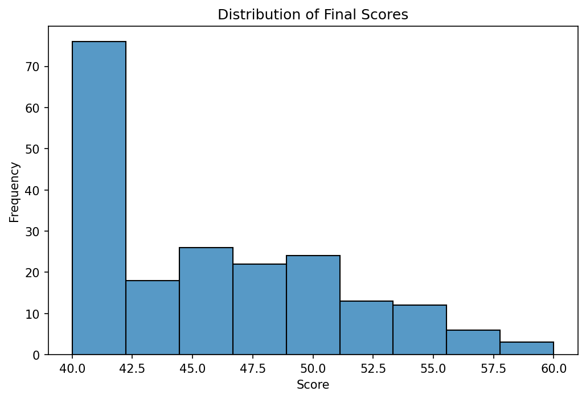
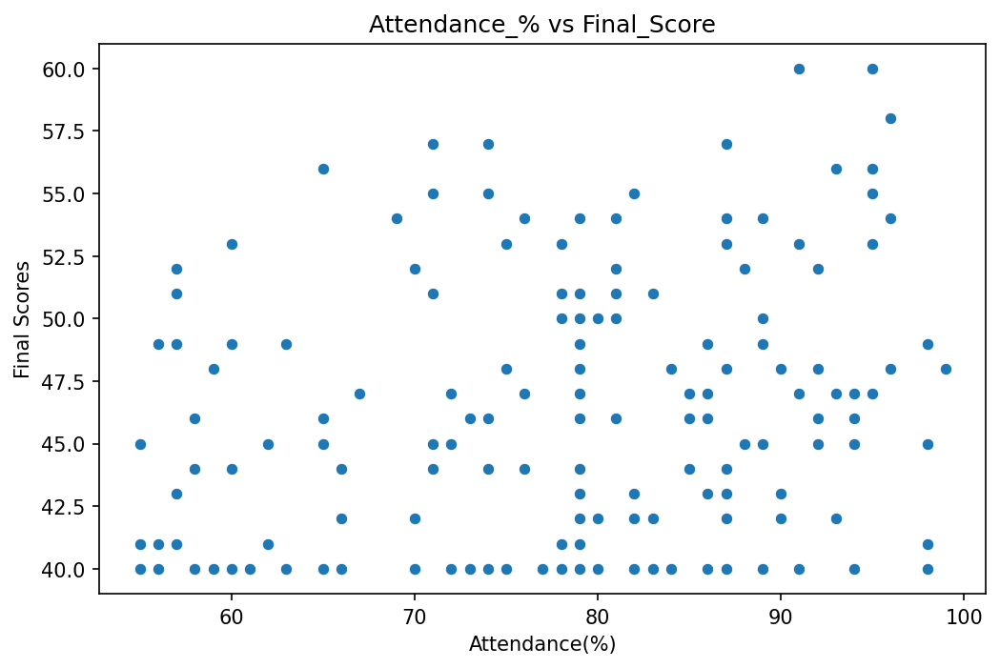
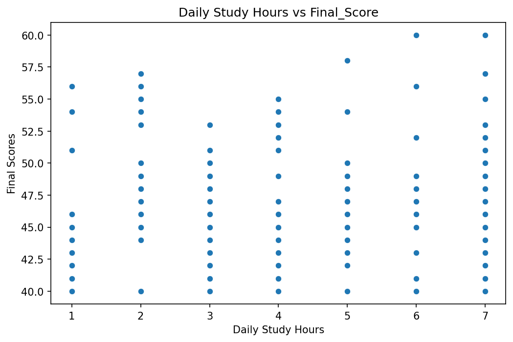
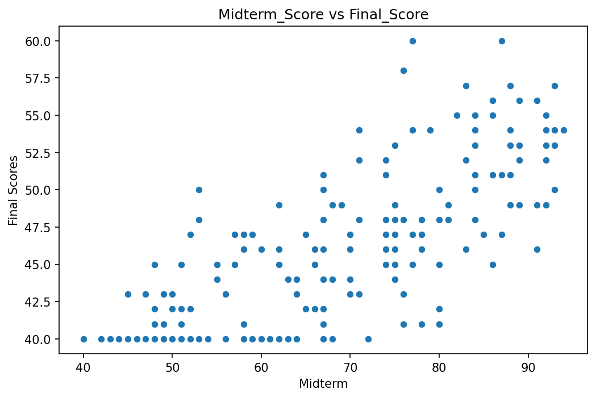
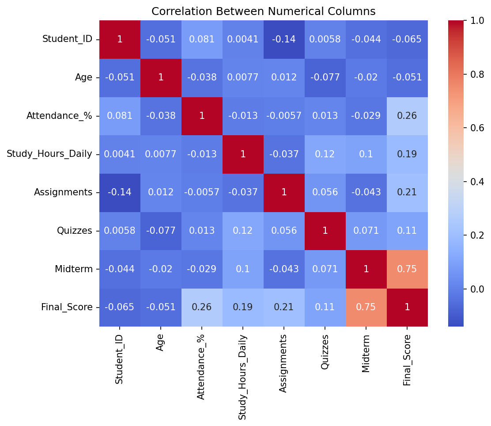
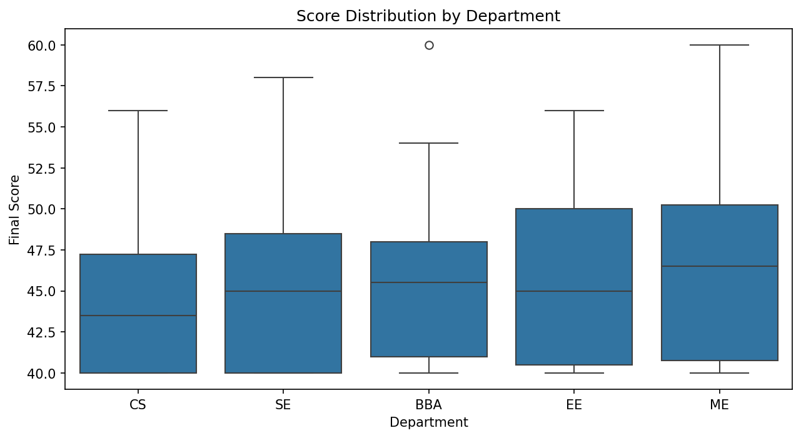
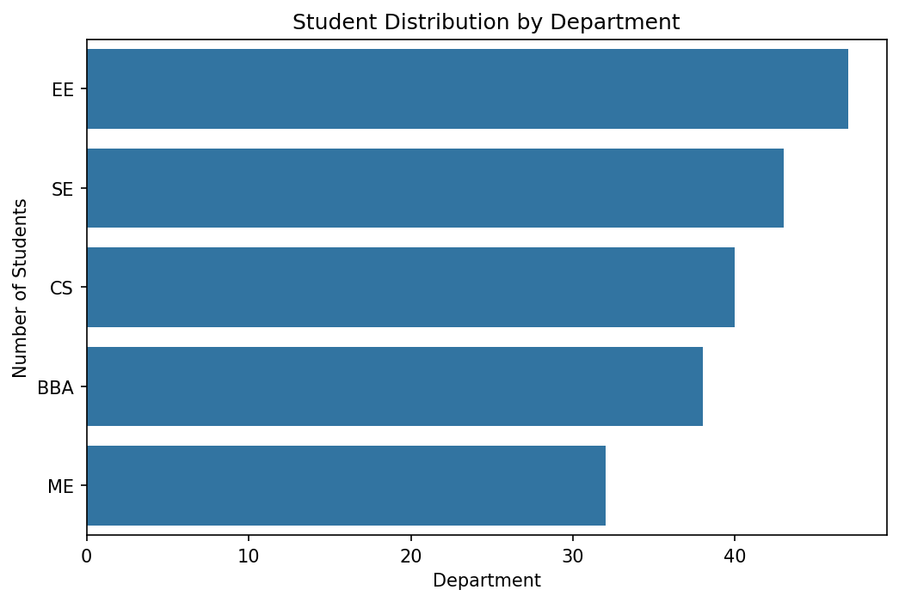

<div align="center">


<br/>


-00bfa5?style=for-the-badge)


<br/><br/>

> *"In God we trust. All others must bring data."*
> — **W. Edwards Deming**

<br/>

</div>

---

## ◈ What This Is

A complete end-to-end **Data Science pipeline** built as an assignment for the **DECODE Data Science Club(GDGoC)**. Starting from a deliberately messy 205-row student dataset riddled with 7 categories of problems — wrong data types, inconsistent casing, impossible values, missing data, duplicates — and taking it all the way through cleaning, exploration, feature engineering, and a trained **Linear Regression model** that predicts student final scores.

Every decision is documented. Every fix is justified. Every chart has an interpretation. That's not just good data science — that's how it was graded.

---

## ◈ The Pipeline

```
RAW DATA (messy, broken, unreliable)
      │
      ▼
STEP 1 — Load & Inspect
      │   shape, dtypes, describe, missing value audit
      ▼
STEP 2 — Clean (7 problems fixed)
      │   casing, wrong types, impossible values, missing fills, duplicates
      ▼
STEP 3 — EDA + Visualization
      │   7 charts, 3 actionable insights, every chart interpreted
      ▼
STEP 4 — Feature Engineering + sklearn Pipeline
      │   new features, encoding decisions, scaling, train/test split
      ▼
STEP 5 — Model Training + Evaluation
      │   LinearRegression, MAE / RMSE / R², coefficient analysis
      ▼
PREDICTIONS (reliable, explainable, documented)
```

---

## ◈ Project Structure

```
student-performance-predictor/
│
├── data/
│   └── cleaned_student_performance_dataset.xlsx        ← cleaned dataset used for modeling
|   └── student_performance_dataset.xlsx        ← messy dataset for pipeline
│
├── notebooks/
│   ├── 01_data_loading_&_cleaning.ipynb  ← Step 1 and Step 2
│   ├── 02_visualizations_EDA.ipynb  ← Step 3
│   └── 03_feature_engineering_&_model_eval.ipynb  ← Step 4 and Step 5
│
├── requirements.txt
└── README.md
```

---

## ◈ The Dataset

**205 rows. 14 columns. 7 categories of problems.**

<div align="center">

| Column | Type | Role |
|:---:|:---:|:---|
| Student_ID | Numerical | Unique ID — dropped before modeling |
| Name | Text | Student name — casing issues |
| Age | Numerical | Wrong dtype — text values present |
| Gender | Categorical | Inconsistent casing — Male/MALE/female |
| City | Categorical | No natural order |
| Department | Categorical | CS/EE/ME/BBA/SE — inconsistencies |
| Education_Level | Categorical | Ordered — Intermediate/Bachelors/Masters |
| Attendance_% | Numerical | Missing + impossible values |
| Study_Hours_Daily | Numerical | Missing values |
| Assignments | Numerical | Score out of 10 — missing values |
| Quizzes | Numerical | Score out of 20 |
| Midterm | Numerical | Missing values |
| Internet_Access | Categorical | Yes/No — no natural order |
| **Final_Score** | **Numerical** | **TARGET — what we predict** |

</div>

---

## ◈ Step 2 — The 7 Problems Fixed

```python
# Every fix below has a documented reason in the notebook.
# Why median not mean? Why drop not fill? All justified.

# 1. Gender casing — male, MALE, female, FEMALE → Male / Female
df['Gender'] = df['Gender'].str.title()

# 2. Name casing — ALL CAPS / all lowercase → Title Case
df['Name'] = df['Name'].str.title()

# 3. Department inconsistencies — cs, EE (with space) → CS, EE
df['Department'] = df['Department'].str.upper().str.strip()

# 4. Age wrong dtype — 'twenty', 'nineteen' → NaN → median fill
df['Age'] = pd.to_numeric(df['Age'], errors='coerce')
df['Age'].fillna(df['Age'].median(), inplace=True)

# 5. Impossible Attendance — below 0 or above 100 → NaN → median
df['Attendance_%']=df['Attendance_%'].mask((df['Attendance_%'] > 100) | (df['Attendance_%'] < 0),np.nan)
df['Attendance_%'] = df['Attendance_%'].fillna(df['Attendance_%'].median())

# 6. Impossible Final_Score — above 100 → NaN → median
df['Final_Score'] = df['Final_Score'].mask((df['Final_Score'] > 100), np.nan)
df['Final_Score'] = df['Final_Score'].fillna(df['Final_Score'].median())

# 7. Duplicates — 5 exact duplicate rows removed
df.drop_duplicates(inplace=True)
```

---

## ◈ Step 3 — EDA Highlights

**7 visualizations. Every chart interpreted. 3 actionable insights extracted.**

<details>
<summary><b>📊 Chart 1 — Distribution of Final Score</b></summary>
<br/>



> The distribution of Final_Score is approximately normal, centered around the mid-60s to low-70s range. Most students score between 55 and 85, with very few extreme outliers on either end.

</details>

<details>
<summary><b>📈 Chart 2 — Attendance % vs Final Score</b></summary>
<br/>



> A positive correlation is visible — students with higher attendance tend to score higher. The trend is consistent though scattered, suggesting attendance is a contributor but not the sole driver.

</details>

<details>
<summary><b>📈 Chart 3 — Study Hours vs Final Score</b></summary>
<br/>



> Students who study more hours daily generally achieve higher final scores. The relationship is positive and moderately strong — one of the cleaner correlations in the dataset.

</details>

<details>
<summary><b>📈 Chart 4 — Midterm vs Final Score</b></summary>
<br/>



> Midterm score shows the strongest individual correlation with Final_Score. Students who perform well in midterms almost consistently perform well overall — making it the single most predictive feature.

</details>

<details>
<summary><b>🔥 Chart 5 — Correlation Heatmap</b></summary>
<br/>



> Midterm, Study_Hours_Daily and Attendance_% show the highest positive correlation with Final_Score. Student_ID shows near-zero correlation confirming it carries no predictive value and should be dropped.

</details>

<details>
<summary><b>📦 Chart 6 — Final Score by Department</b></summary>
<br/>



> Median scores are relatively consistent across departments with slight variation. No single department dramatically outperforms others suggesting Final_Score is driven more by individual habits than department affiliation.

</details>

<details>
<summary><b>🔢 Chart 7 — Students per Department</b></summary>
<br/>



> The dataset is reasonably balanced across departments with no extreme underrepresentation. This ensures the model does not develop a bias toward any particular department during training.

</details>

---

## ◈ Step 4 — Feature Engineering

```python
# New feature: combined academic performance signal
df['Total_Academic'] = (
    df['Midterm'] +
    df['Assignments'] * 5 +
    df['Quizzes'] * 2
)

# Attendance bucketed into interpretable categories
df['Attendance_Category'] = pd.cut(
    df['Attendance_%'],
    bins=[0, 60, 80, 100],
    labels=['Low', 'Medium', 'High']
)
```

**Encoding decisions — every choice justified:**

<div align="center">

| Column | Encoding | Why |
|:---:|:---:|:---|
| Gender | One-Hot | No order between Male and Female |
| Internet_Access | One-Hot | No order between Yes and No |
| City | One-Hot | No order between cities |
| Department | One-Hot | No order between departments |
| Education_Level | Ordinal | Order exists: Intermediate < Bachelors < Masters |
| Attendance_Category | Ordinal | Order exists: Low < Medium < High |

</div>

**A note on the preprocessing approach:**
Both manual preprocessing and sklearn ColumnTransformer Pipeline were implemented. The manual approach is fully written and commented out — kept for transparency and learning reference. The Pipeline approach is the active implementation, satisfying both assignment conditions without doing the work twice.

---

## ◈ Step 5 — Model Evaluation Report

<div align="center">

```
┌─────────────────────────────────────────────────────────┐
│                                                         │
│   Training Records    →   146                           │
│   Testing Records     →   46                            │
│                                                         │
│   MAE                 →   2.44   (~3 marks average)     │
│   RMSE                →   3.26   (penalizes big errors) │
│   R² Score            →   0.60  (60% variance explained)│
│                                                         │
│   Intercept           →   ~18    (baseline prediction)  │
│                                                         │
└─────────────────────────────────────────────────────────┘
```

</div>

**What the numbers mean:**

**MAE of 2.44** — on average the model's prediction is within ~3 marks of the actual final score. For a student scoring 75, the model likely predicts between 72 and 78.

**RMSE of 3.26** — slightly higher than MAE because larger errors get penalized more heavily when squared. The gap between MAE and RMSE is small, meaning there are no catastrophic outlier predictions.

**R² of 0.60** — the model explains 60% of the variance in Final_Score. Solid for a Linear Regression on a noisy real-world dataset. The remaining 40% is influenced by factors not captured — class participation, personal circumstances, teaching quality.

**Key drivers identified:** Attendance percentage, Study_Hours_Daily, and Midterm score carry the highest positive coefficients — the strongest predictors of a student's final score.

---

## ◈ Next Steps

```
→  Include class participation as a feature
→  Expand dataset beyond 205 rows for better pattern mapping
→  Explore Polynomial Regression for non-linear relationships
→  Try ensemble methods — Random Forest, Gradient Boosting
→  Cross-validation for more robust evaluation
```

---

## ◈ Skills This Project Demonstrates

<div align="center">


</div>

---

## ◈ How to Run

```bash
# Clone
git clone https://github.com/MuhammadAhmadHamim/student-performance-predictor

# Install dependencies
pip install -r requirements.txt

# Open notebooks in order
jupyter notebook
# → 01_data_loading_cleaning.ipynb
# → 02_visualizations_EDA.ipynb
# → 03_feature_engineering_model.ipynb
```

---

<div align="center">


*Raw data in. Predictions out. Everything in between — documented.*

</div>
